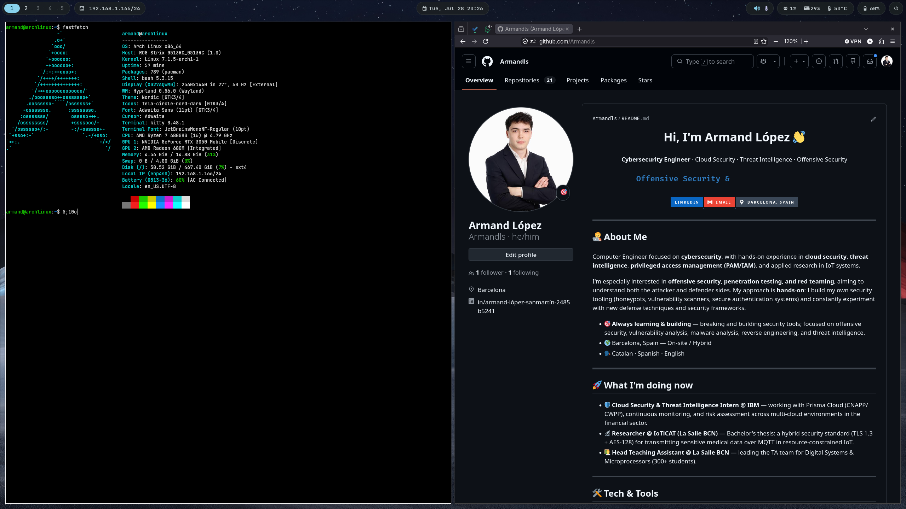

# dotfiles

Personal configuration of my **Arch Linux + Hyprland** (Wayland) setup on an
ASUS laptop with hybrid graphics. Managed with [GNU Stow](https://www.gnu.org/software/stow/).

Theme: **Nord** (dark), unified across GTK and Qt.

## Screenshots



## Stack

| Component | Program |
|-----------|---------|
| Compositor | Hyprland `0.56.0` (Wayland) |
| Session manager | uwsm `0.26.6` |
| Display manager | SDDM `0.21` (sugar-candy theme) |
| Bar | Waybar `0.15` |
| Launcher | Rofi `2.0` |
| Notifications | Dunst `1.13` |
| Wallpaper / idle / lock | hyprpaper · hypridle · hyprlock |
| Terminal | Kitty `0.48` |
| File manager | Dolphin |
| Audio | PipeWire `1.6` + WirePlumber |
| Network | NetworkManager |
| Bluetooth | BlueZ + Blueman |
| Authorization | polkit + hyprpolkitagent |
| Screenshots | grim + slurp + wl-clipboard |
| Clipboard | wl-clipboard |
| Power menu | wlogout (Nord styled) |
| Cursor | Bibata-Modern-Ice |
| Font | JetBrainsMono Nerd Font |
| GTK/Qt theme | Nordic (GTK) + qt6ct/Fusion with Nord palette |

## Setup highlights

- **Boot via UKI (Unified Kernel Image)** loaded by GRUB, with **TPM2** and
  measured boot. Kernel + initramfs + microcode packed into a single signable
  `.efi`.
- **Session launched with uwsm** (Hyprland managed as systemd user services),
  not the classic direct launch.
- **ASUS laptop with hybrid graphics**: AMD Radeon 680M (iGPU) +
  NVIDIA RTX 3050 Mobile (dGPU), with `nvidia-open` + `mesa` and the EGL/Wayland
  stack. ASUS control via `asusctl` / `supergfxctl`.
- **Battery charge limited to 60%** to extend its lifespan.
- **Hyprland configured in Lua** (not the traditional `.conf` format).
- Wayland environment variables managed through `~/.config/environment.d/`.

## Structure (Stow packages)

```
.dotfiles/
├── hypr/          → ~/.config/hypr
├── waybar/        → ~/.config/waybar
├── rofi/          → ~/.config/rofi
├── dunst/         → ~/.config/dunst
├── kitty/         → ~/.config/kitty
├── gtk-3.0/       → ~/.config/gtk-3.0
├── gtk-4.0/       → ~/.config/gtk-4.0
├── qt6ct/         → ~/.config/qt6ct
├── wlogout/       → ~/.config/wlogout
├── environment.d/ → ~/.config/environment.d
└── bash/          → ~/.bashrc, ~/.bash_profile
```

## Installation

```bash
# 1. Clone into HOME
git clone https://github.com/Armandls/dotfiles.git ~/.dotfiles
cd ~/.dotfiles

# 2. Install dependencies (official repos)
sudo pacman -S --needed hyprland uwsm waybar rofi dunst hyprpaper hypridle \
  hyprlock kitty dolphin sddm pipewire wireplumber networkmanager bluez \
  blueman polkit hyprpolkitagent grim slurp wl-clipboard brightnessctl \
  power-profiles-daemon nvidia-open mesa qt6ct stow \
  ttf-jetbrains-mono-nerd tela-circle-icon-theme-nord wlogout

# 3. AUR dependencies
yay -S --needed nordic-theme asusctl supergfxctl bibata-cursor-theme

# 4. Deploy with Stow
stow bash dunst environment.d gtk-3.0 gtk-4.0 hypr kitty qt6ct rofi waybar wlogout
```

## License

[MIT](LICENSE)
